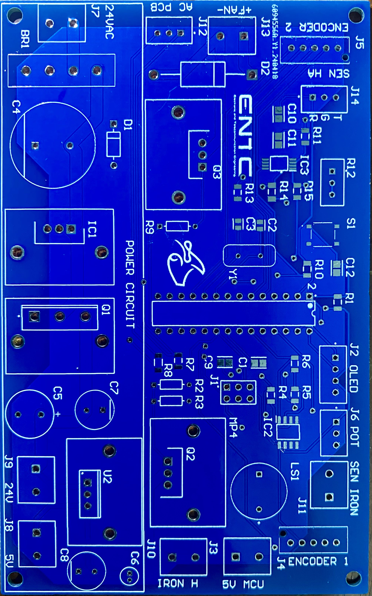

# Smart-Soldering-Staion
# ATmega328P Soldering Station

## Table of Contents
- [Introduction](#introduction)
- [Overview](#overview)
- [System Block Diagram](#system-block-diagram)
- [Schematic Diagram](#schematic-diagram)
- [PCB Layout](#pcb-layout)
- [Component List](#component-list)
- [Microcontroller Programming](#microcontroller-programming)
- [Operation](#operation)
- [Safety Features](#safety-features)

## Introduction
The ATmega328P Soldering Station is designed to provide precise temperature control for soldering tasks. This document outlines the design, components, and operation of the soldering station.

## Overview
This soldering station utilizes the ATmega328P microcontroller for temperature control, providing accurate and stable performance. The user interface includes an LCD display and push buttons for setting and monitoring the temperature.

## System Block Diagram
The system block diagram illustrates the main components and their interactions within the soldering station. The microcontroller reads the temperature sensor and controls the heating element to maintain the desired temperature. The user interface allows the user to set the temperature and view the current status.

## Schematic Diagram

The schematic diagram provides a detailed view of the electrical connections and components used in the soldering station.

## PCB Layout
### 2D View

### 3D View

The PCB layout shows the placement of components on the board. The design optimizes space and ensures proper heat dissipation.

## PCB Layout
### 2D View

### 3D View


## Component List
- **Microcontroller:** ATmega328P
- **Display:** 16x2 LCD screen
- **Temperature Sensor:** Thermocouple
- **Controls:** Push buttons
- **Heating Element:** Soldering iron
- **Other Components:** Resistors, capacitors, connectors

## Microcontroller Programming
The ATmega328P microcontroller is programmed using Atmel Studio. Follow these steps to configure and upload the code:

1. **Install Atmel Studio:** Download and install Atmel Studio.
2. **Open Project:** Open the provided project file in Atmel Studio.
3. **Configure Settings:** Set the microcontroller (ATmega328P) and configure fuse bits.
4. **Write Code:** Develop or modify the code as needed.
5. **Build Project:** Compile the project to check for errors.
6. **Upload Code:** Use a programmer (e.g., USBasp) to upload the compiled code to the ATmega328P.

```c
// Example Code Snippet
#include <avr/io.h>
#include <util/delay.h>

#define F_CPU 16000000UL

int main(void) {
    // Set up code
    DDRB |= (1 << PB0); // Set PB0 as output

    while (1) {
        // Main loop
        PORTB ^= (1 << PB0); // Toggle PB0
        _delay_ms(1000); // Delay 1 second
    }
    return 0;
}
The SmartSolder Station is a high-performance soldering solution with a soldering iron and hot air gun. Featuring advanced PID temperature control and multiple modes, it ensures precise, efficient, and reliable soldering. Explore our documentation, schematics, and source code to build your own state-of-the-art soldering station.
